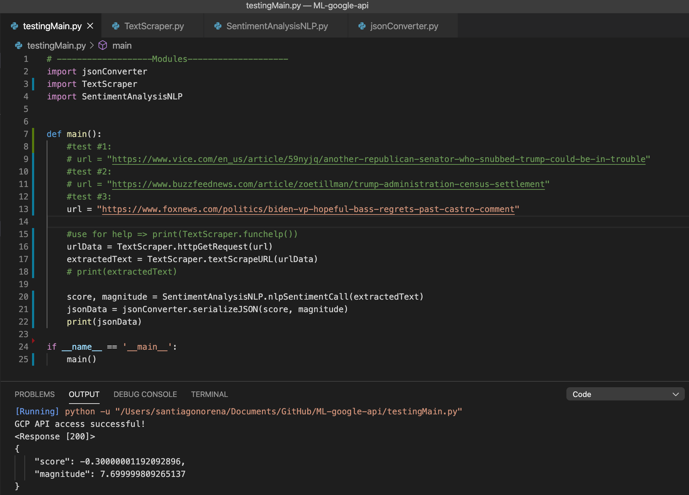

# ML-google-api

Includes:
## Sentiment Analysis for Websites 
folder name: nlp_sentiment-analysis
-----------
- Library to parse to html from a url and scrape text. 
- Library to use the sentiment analysis API from Google Cloud Platform (*Requires an API key to access)
- Library to parse JSON or serialize to JSON
- See testingMain.py on how to use files

#### Results:
- Provides values for "magnitude" (level of emotion in text) and "score" (positive or negative)

